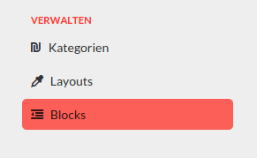

Luya Admin Module Page
======================



@TODO: change from news example to news category example cause of not clear declarated api name "api-news-news"

How to create a new Module Navigation Item (Page) in a Luya Admin Module.

1. Create Model and NG Rest Config
2. Create API Controller
3. Add Module API Endpoint
4. Create Module Controller
5. Add Module Menu Entry

We assume to already have Migration Entry which creates the Database table.

1. Create Model and NG Rest Config
--------------------------------

Create the ActiveRecord model in <ADMIN_MODULE>/models/<MODEL_NAME>. We assume to create a new News Module Navigation Item, so we call the new model News.

In this example we just have name, title and text which is required for all the rest scenarios "restcreate" and "restupdate". There are cases which does not require fields on create but require them on update.

***NEW*** you now have to implement those ngrest methods: getNgRestApiEndpoint(), getNgRestPrimaryKey(), ngRestConfig($config);

```php
<?php
namespace newsadmin\models;

class News extends \admin\ngrest\base\Model
{
    public static function tableName()
    {
        return 'news';
    }
    
    public function rules()
    {
        return [
            [['name', 'title', 'text'], 'required']
        ];
    }
    
    public function scenarios()
    {
        return [
            'restcreate' => ['name', 'title', 'text'],
            'restupdate' => ['name', 'title', 'text'],
        ];
    }
    
    /* ng-rest method config */
    
    public $ngRestEndpoint = 'api-news-news';
    
    public function ngRestConfig($config) 
    {
        $config->list->field("name", "Name")->text()->required();
        $config->list->field("title", "Titel")->text()->required();
        $config->list->field("text", "Text")->textarea()->required();
        
        $config->create->copyFrom('list', ['id']);
        $config->update->copyFrom('list', ['id']);
        
        return $config;
    }
    
}
```

If you want to add multlingual fields, just add an array for the to configure fields in the $i18n variable like this:
```php
class News extends \admin\ngrest\base\Model
{
	...
	
	public $i18n = ['title', 'text'];
	
	...
}
```

Now all the crud actions for the fields "title" and "text" are available in the system languages. It will generate a json inside of the sql table which gets en/decoded.

2. Create API Controller
------------------------

Create a new file in the apis folder. For instance NewsController.php

```php
<?php
namespace news\apis;

class NewsController extends \admin\base\RestActiveController
{
    public $modelClass = 'newsadmin\models\News';
}

```

3. Add Module API Endpoint
---------------------------

Add an array entry in Module.php to public static $apis variable which defines the end point for you API. In this case the REST API Endpoint would look like:

http://yourexample.com/admin/api-news-news

```php
<?php
namespace news;

class Module extends \admin\base\Module
{
    public static $apis = [
    	...
        'api-news-news' => 'newsadmin\\apis\\NewsController',
        ...
    ];
```


4. Create Module Controller 
----------------------------------------------

Let the controller know your model

```php
<?php
namespace newsadmin\controllers;

class NewsController extends \admin\ngrest\base\Controller
{
	public $modelClass = 'newsadmin\models\News';
}
```

5. Add Module Menu Entry
--------------------------

the newsadmin-news-index references to the yii MVC path for the controller defined in step 4. So its <MODULE>-<CONTROLLER>-<ACTION>.

```php
public function getMenu()
{
    $node = $this->menu->createNode('news', 'News', 'fa-ils');
    $this->menu->createGroup($node, 'Verwalten', [
    	...
        $this->menu->createItem('news', "News Items", "newsadmin-news-index", "<FONTAWESOME_CLASS"),
        ....
    ]);

    return $this->menu->get();
}
```